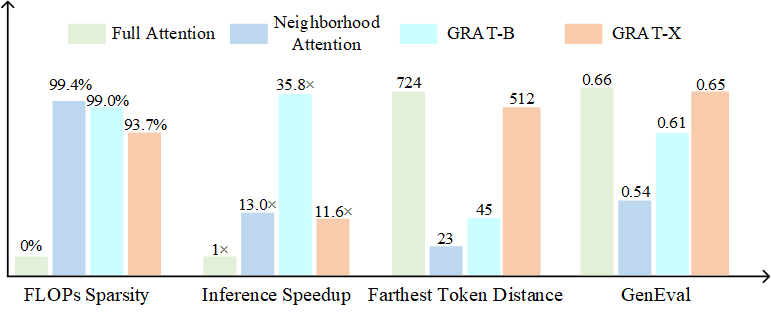

# GRAT
[](https://arxiv.org/abs/2505.14687)
[](https://oliverrensu.github.io/project/GRAT/)


This repository is the official implementation of our [Grouping First, Attending Smartly: Training-Free Acceleration for Diffusion Transformers](https://arxiv.org/abs/2505.14687)

## Introduction
Diffusion-based Transformers have demonstrated impressive generative capabilities, but their high computational costs hinder practical deployment—for example, generating an $8192\times8192$ image can take over an hour on an A100 GPU.
In this work, we propose GRAT (GRouping first, ATtending smartly), a training-free attention acceleration strategy for fast image and video generation without compromising output quality.
The key insight is to exploit the inherent sparsity in learned attention maps (which tend to be locally focused) in pretrained Diffusion Transformers and leverage better GPU parallelism.
Specifically, GRAT first partitions contiguous tokens into non-overlapping groups, aligning both with GPU execution patterns and the local attention structures learned in pretrained generative Transformers.
It then accelerates attention by having all query tokens within the same group share a common set of attendable key and value tokens. These key and value tokens are further restricted to structured regions, such as surrounding blocks or criss-cross regions, significantly reducing computational overhead (e.g., attaining a 35.8$\times$ speedup over full attention when generating $8192\times8192$ images) while preserving essential attention patterns and long-range context.
We validate GRAT on pretrained Flux and HunyuanVideo for image and video generation, respectively.
In both cases, GRAT achieves substantially faster inference without any fine-tuning, while maintaining the performance of full attention.
We hope GRAT will inspire future research on accelerating Diffusion Transformers for scalable visual generation.

## Generate a video
```python
python main.py
```
Generate a 5s 720p video.


## Reference
If you have any question, feel free to contact [Sucheng Ren](oliverrensu@gmail.com)

```
@article{ren2025grate,
  title={Grouping First, Attending Smartly: Training-Free Acceleration for Diffusion Transformers},
  author={Ren, Sucheng and Yu, Qihang and He, Ju and Yuille, Alan and Chen, Liang-Chieh},
  journal={arXiv preprint arXiv:2505.14687},
  year={2025}
}
```

## Acknowledgement
[CLEAR](https://github.com/Huage001/CLEAR)

